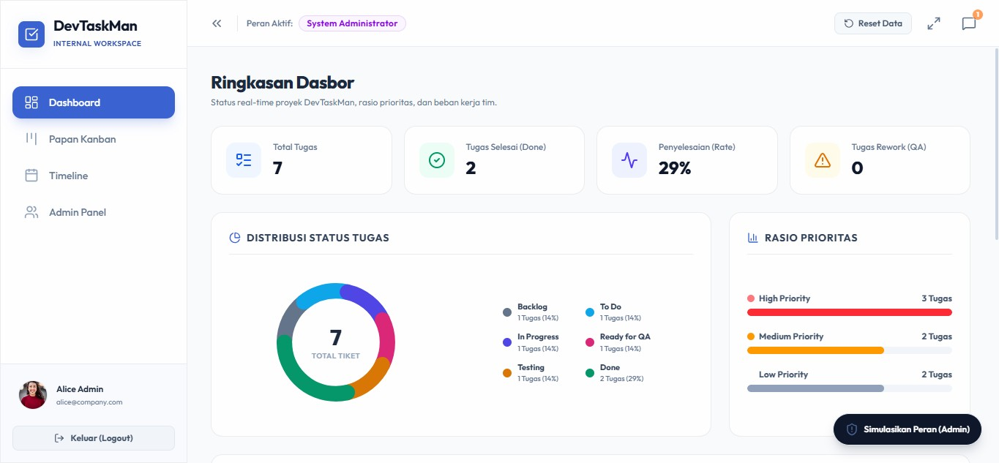
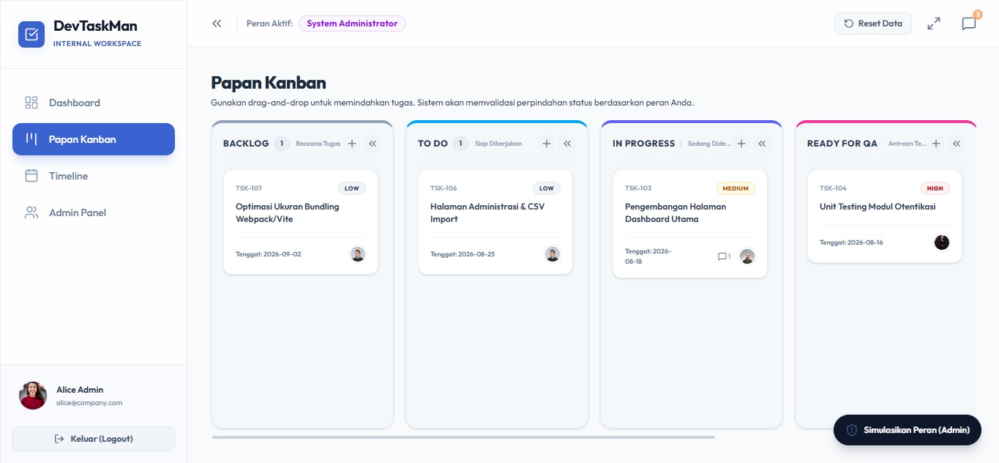
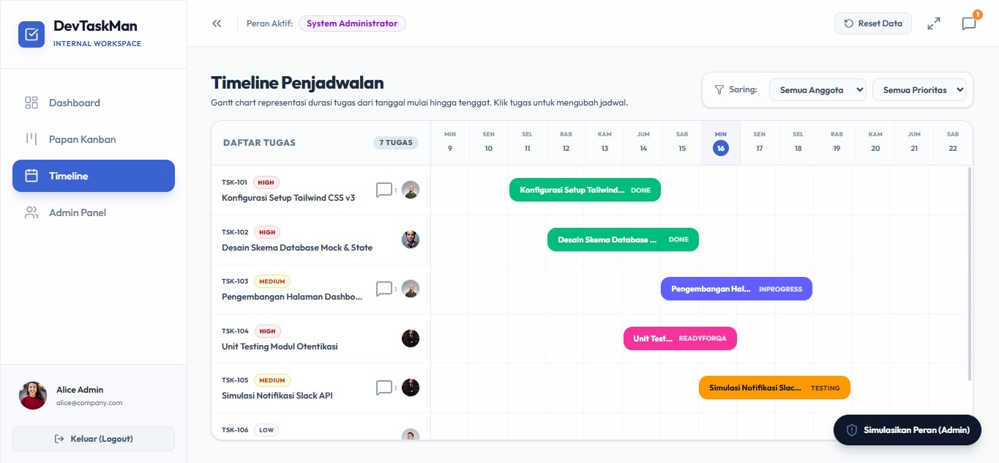
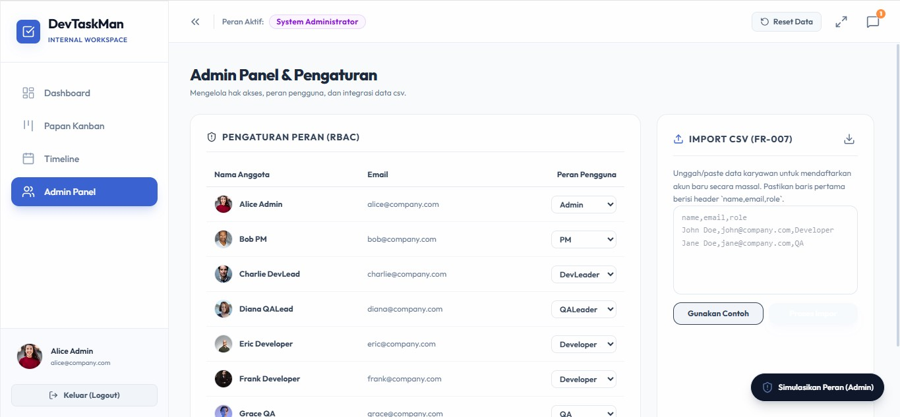

# DevTaskMan

Sistem Pelacakan Tugas Internal untuk kolaborasi tim Developer & QA — Kanban board, RBAC, notifikasi real-time, dan dasbor pelaporan. Lihat [`BRD_DevTaskMan.md`](BRD_DevTaskMan.md) untuk requirement bisnis lengkap.

## Screenshots

| Dashboard | Papan Kanban |
| :---: | :---: |
|  |  |

| Timeline | Admin Panel |
| :---: | :---: |
|  |  |

## Struktur Proyek

```
backend/    ExpressJS + TypeScript REST API (JWT auth, RBAC, PostgreSQL, SSE notifications)
frontend/   React + TypeScript + Vite SPA (Tailwind CSS)
e2e/        Playwright end-to-end test suite
openspec/   Spec-driven change history (proposal → apply → archive)
```

## Tech Stack

- **Backend**: Express, TypeScript, PostgreSQL (`pg`), JWT (`jsonwebtoken`), `bcryptjs`, `helmet`, `express-rate-limit`, `express-validator`, Swagger (`swagger-jsdoc` + `swagger-ui-express`)
- **Frontend**: React 19, TypeScript, Vite, React Router, Tailwind CSS, `lucide-react`
- **E2E**: Playwright (Chrome via system `channel`)

## Menjalankan Secara Lokal

### 1. Backend

```bash
cd backend
npm install
cp .env.example .env   # sesuaikan kredensial PostgreSQL Anda
npm run dev             # http://localhost:5000
```

Jika PostgreSQL tidak dapat dihubungi, backend otomatis fallback ke penyimpanan in-memory dengan data seed yang sama — cocok untuk demo cepat tanpa setup database.

Dokumentasi API tersedia di `http://localhost:5000/api-docs` (Swagger UI) setelah server berjalan.

### 2. Frontend

```bash
cd frontend
npm install
npm run dev              # http://localhost:5173
```

Login menggunakan salah satu akun demo bawaan (lihat layar login) — semua akun seed berbagi password `password123`.

### 3. E2E Tests (opsional)

```bash
cd e2e
npm install
npx playwright install chrome   # sekali saja
npm test                        # headless
npm run test:headed             # dengan browser terlihat
```

Suite ini otomatis menyalakan backend & frontend dev server serta mereset data seed sebelum berjalan.

## Alur Pengembangan (OpenSpec)

Proyek ini mengikuti alur spec-driven: setiap perubahan fitur diajukan sebagai proposal di `openspec/changes/`, diterapkan, lalu diarsipkan ke `openspec/changes/archive/` dan digabung ke `openspec/specs/`. Jalankan `openspec list` atau `openspec view` untuk menjelajahi riwayat dan spesifikasi kapabilitas yang ada.
